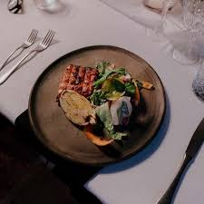
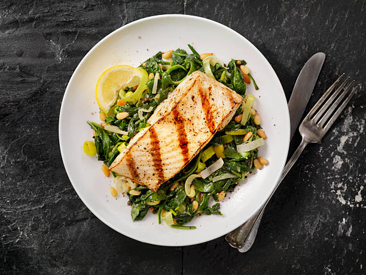

# 🍽️ Restaurant App - Frontend


This is the **Frontend Client** for the Full-Stack Food Restaurant Web App. It provides a responsive, modern, and interactive user interface for users to browse menus, view the team, and book table reservations.

---

## 🔗 Live Demo
🚀 **View the UI here:** [https://restaurent-app-indol.vercel.app/](https://restaurent-app-indol.vercel.app/)

---

## ✨ UI Features

*   **Responsive Layout:** seamless experience across Mobile, Tablet, and Desktop.
*   **Modern Hero Section:** Engaging landing page with high-quality visuals.
*   **Menu Showcase:** organized display of Breakfast, Lunch, and Dinner options.
*   **Reservation Form:** A user-friendly form to book tables with real-time validation.
*   **Navigation:** Smooth scrolling and easy navigation using React Router.
*   **State Management:** Efficient handling of form inputs and UI states using React Hooks.

---

## 🛠️ Tech Stack (Frontend)

*   **Framework:** [React.js](https://reactjs.org/)
*   **Build Tool:** [Vite](https://vitejs.dev/)
*   **Styling:** CSS3 (Custom Styling)
*   **Routing:** React Router DOM
*   **HTTP Client:** Axios (for connecting with Backend)

---

## 📂 Folder Structure

The frontend is structured to be modular and scalable:

```bash
Frontend/
├── public/             # Static Assets (Images, Logos)
├── src/
│   ├── components/     # Reusable UI Components
│   │   ├── Navbar.jsx
│   │   ├── HeroSection.jsx
│   │   ├── About.jsx
│   │   ├── Qualities.jsx
│   │   ├── Menu.jsx
│   │   ├── WhoAreWe.jsx
│   │   ├── Team.jsx
│   │   ├── Reservation.jsx
│   │   └── Footer.jsx
│   ├── pages/          # Main Pages
│   │   ├── Home.jsx
│   │   ├── Success.jsx
│   │   └── NotFound.jsx
│   ├── App.jsx         # Main App Component
│   └── main.jsx        # Entry Point
├── index.html
└── vite.config.js
```

---

## 🚀 Installation & Setup

Follow these steps to run the frontend locally:

### 1. Navigate to Frontend Directory
If you have cloned the main repository, move into the frontend folder:
```bash
cd Frontend
```

### 2. Install Dependencies
Install the required node modules:
```bash
npm install
```

### 3. Configure API Connection
Ensure the frontend is pointing to the correct backend URL. Check `App.jsx` or the API service file to ensure the POST request is sending data to your local or deployed backend (e.g., `http://localhost:4000/api/v1/reservation/send`).

### 4. Run Development Server
Start the Vite server:
```bash
npm run dev
```

The app will start running at `http://localhost:5173/`.

---

## 📸 Component Previews

Here is a glimpse of the key sections of the website:

| **Hero Section** | **Reservation Section** |
| :---: | :---: |
|  |  |

| **Our Team** | **Menu Display** |
| :---: | :---: |
|  |  |

---

## 👨‍💻 Author

**Bhuv Sai**
*   **GitHub:** [bhuv-sai](https://github.com/bhuv-sai)
*   **Project Repo:** [Restaurant App](https://github.com/bhuv-sai/restaurent-app)
